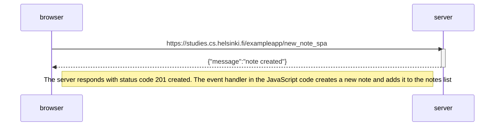

```mermaid
sequenceDiagram
    participant browser
    participant server

    browser->>server: https://studies.cs.helsinki.fi/exampleapp/new_note_spa
    activate server
    server-->>browser: {"message":"note created"}
    deactivate server
    Note right of browser: The server responds with status code 201 created. The event handler in the JavaScript code creates a new note and adds it to the notes list

```